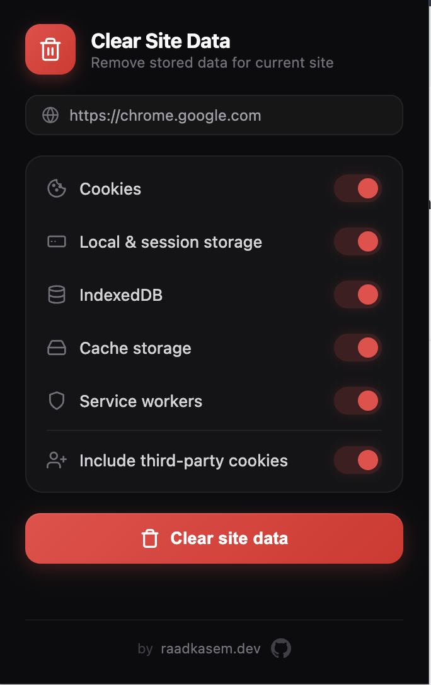

# Clear Site Data

Chrome extension to clear current website data — like Chrome DevTools Application tab, one click away.

## Features

- Cookies (first-party & third-party)
- Local & session storage
- IndexedDB
- Cache storage
- Service workers

Third-party cookie clearing is enabled by default — detects third-party domains from page resources and removes their cookies.

## Install

1. Clone or download this repo
2. Open `chrome://extensions`
3. Enable **Developer mode**
4. Click **Load unpacked** and select the project folder

## Screenshot

## License

[MIT](LICENSE)

## Author

**Raad Kasem** — [raadkasem.dev](https://raadkasem.dev) · [GitHub](https://github.com/raadkasem)
